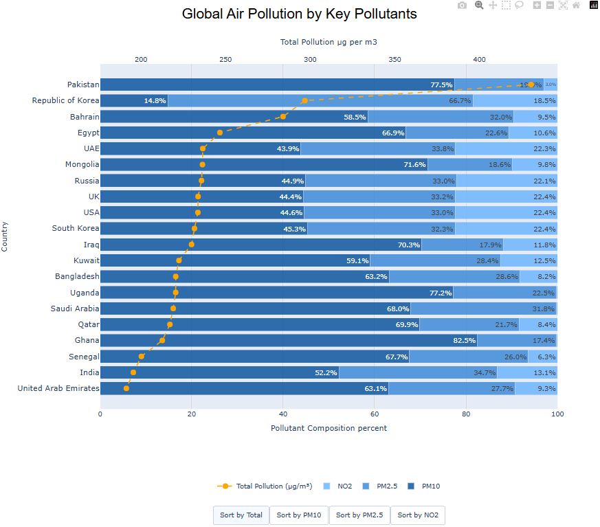

# Analyzing Global Air Pollution by Key Pollutants 

## Overview

This project investigates global air pollution across multiple countries by merging, cleaning, and analyzing three large-scale datasets.  
The focus is on three major pollutants:

- **PM2.5**
- **PM10**
- **NO₂**

The goal is to identify national and regional *pollution signatures* and understand how each pollutant contributes to overall air quality worldwide.

This project was carried out for Semester 1 of the MSc in Computing (Data Analytics) course Data Visualization & Management by Achal Nanjundamurthy (achalnm02@gmail.com) and Rupam Misra (rupammisra2222@gmail.com)

---

## Datasets

The repository contains all the datasets used in this project along with the report:

- **Dataset 1:** Global Air Pollution Dataset (~23,000 rows) — CO, NO₂, PM2.5 readings  
- **Dataset 2:** Global Air Quality Dataset (~10,000 rows) — Includes PM10 and climate variables  
- **Dataset 3:** WHO Air Quality Database (~32,000 rows) — Used for validation and correction  

All datasets have been uploaded to this repository as CSV files.

---

## Technical Workflow

The analysis followed a structured **8-step data engineering pipeline**:

1. **Loading & Inspection:** Imported 60,000+ records and assessed data structures  
2. **Standardization:** Converted AQI values into real concentration units (µg/m³) using EPA formulas  
3. **Feature Selection:** Filtered essential location and pollutant fields for consistency  
4. **Imputation:** Handled missing values using country-level mean imputation  
5. **Aggregation:** Summarized pollutant levels to determine national trends  
6. **Merging:** Performed outer joins to create a unified global dataset of 185 countries  
7. **Final Cleaning:** Averaged values across datasets and applied global mean fallbacks for gaps  
8. **Scoring:** Calculated a **Total Pollution Score** and percentage contributions for each pollutant  

---

## Key Findings

- **Regional Extremes:** South Asian and Middle Eastern countries face the highest pollution levels, with Pakistan reaching ~430 µg/m³  
- **Pollutant Dominance:** Particulate matter (PM2.5 and PM10) contributes 70%–90% of total pollution in highly affected regions  
- **Pollutant Profiles:**  
  - PM10 dominates in dusty/industrial regions  
  - PM2.5 dominates in urbanized nations  
  - NO₂ dominates in areas with high traffic intensity  

---

## Interactive Visualization

The final output is an **interactive horizontal stacked bar chart** built using Plotly:

- **Design:** Monochromatic blue palette for particulate matter with a contrasting axis for the Total Pollution Index  
- **Interactivity:** Hover tooltips for absolute values and dynamic sorting buttons to reorder top 20 countries by specific pollutants  

A screenshot of the chart is included as `visual.png` in this repository:  

---

## Tools & Libraries

- **Language:** Python  
- **Libraries:** Pandas, NumPy, Matplotlib, Seaborn, Plotly  
- **Environment:** Jupyter Notebook / Google Colab  

---

## Repository Contents

This repository contains:

- All **dataset CSV files** used in the analysis  
- The **Jupyter Notebook** containing the full code  
- The **project report** in PDF format  
- **visual.png** — screenshot of the interactive Plotly chart  
