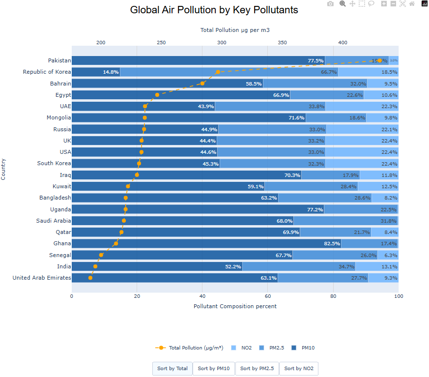

# Analyzing Global Air Pollution by Key Pollutants

Coursework project for the Data Visualisation and Management module, Semester 1, MSc in Computing (Data Analytics).
Team: **Achal Nanjundamurthy** and **Rupam Misra**.

## Overview

Three publicly available air pollution datasets (65,000+ records, 185 countries) were merged, cleaned,
and analyzed to compare national pollution levels and identify which pollutants dominate in different
regions. The output is an interactive Plotly chart showing PM2.5, PM10, and NO2 composition for the
20 most polluted countries.

CO is present in two of the source datasets but was excluded at the feature-selection stage. Dataset 3
(the WHO source) does not include CO, so a consistent three-source comparison was not possible. The
analysis focuses on the three pollutants that appear consistently across all sources and are linked to
chronic exposure: PM2.5, PM10, and NO2.

## Datasets

All three CSV files are included in the `Datasets/` folder.

| File | Rows | Pollutants in source | Source |
| --- | --- | --- | --- |
| `23k global air pollution dataset.csv` | 23,463 | CO, NO2, PM2.5 (as AQI values) | [Kaggle - hasibalmuzdadid](https://www.kaggle.com/datasets/hasibalmuzdadid/global-air-pollution-dataset) |
| `10k global_air_quality_data_10000.csv` | 10,000 | PM2.5, PM10, NO2, SO2, CO (in µg/m³) | [Kaggle - waqi786](https://www.kaggle.com/datasets/waqi786/global-air-quality-dataset) |
| `32k who_aap_2021_v9_11august2022.csv` | 32,191 | PM2.5, PM10, NO2 (in µg/m³) | [WHO Air Quality Database 2022](https://www.who.int/data/gho/data/themes/air-pollution/who-air-quality-database/2022) |

The largest file is ~4 MB (WHO dataset). All three are small enough to include in the repository.

## What the Notebook Does

1. **Load** - Read all three CSVs and inspect shapes and column names.
2. **Standardize** - Rename columns to a common format. Convert Dataset 1 AQI values to real
   concentration units (µg/m³) using EPA breakpoint formulas.
3. **Select features** - Keep country, city, and the relevant pollutant columns from each dataset.
   CO is dropped here.
4. **Impute** - Fill missing values using country-level means.
5. **Aggregate** - Reduce each dataset to one row per country by averaging.
6. **Merge** - Outer-join all three aggregated datasets on country name, producing a single
   185-country table.
7. **Clean** - Average overlapping pollutant columns across datasets. Treat zeros as missing.
   Apply a global mean fallback for remaining gaps.
8. **Score** - Sum PM2.5 + PM10 + NO2 per country to get a total pollution figure, then compute
   each pollutant's percentage share.
9. **Explore** - Correlation heatmap, histograms with KDE curves, and boxplots on a log scale.
10. **Visualize** - Interactive horizontal stacked bar chart of the top 20 most polluted countries.

## Key Findings

- Pakistan has the highest combined total at ~431 µg/m³, with PM10 accounting for 77% of that.
- PM10 is the dominant pollutant (68-83% of total) in dust-heavy regions: Pakistan, Uganda,
  Mongolia, Iraq, Ghana, and Qatar.
- PM2.5 is the main contributor in industrialized nations. Republic of Korea has the highest
  PM2.5 share at 67%.
- NO2 is notable in traffic-heavy countries. UAE, UK, USA, and South Korea each show NO2 at
  roughly 22% of total pollution.
- Across all 185 countries, PM10 averages 62% of total pollution, PM2.5 averages 28%, and
  NO2 averages 10%.

## Visualization

The final chart is an interactive horizontal stacked bar chart built with Plotly. Bars show the
percentage composition of PM10, PM2.5, and NO2 per country. An orange dashed line on a secondary
axis shows total pollution in µg/m³. Sort buttons let you reorder the top 20 countries by total or
by any individual pollutant.

## Tech Stack

- Python 3
- Pandas, NumPy (data wrangling and aggregation)
- Matplotlib, Seaborn (exploratory charts)
- Plotly (interactive final visualization)
- Jupyter Notebook

## Repository Contents

- `Datasets/` - three source CSV files (~6.5 MB total)
- `Analyzing Global Air Pollution by Key Pollutants.ipynb` - full analysis notebook
- `REPORT - Analyzing Global Air Pollution by Key Pollutants.pdf` - written project report
- `visual.png` - screenshot of the final interactive chart
